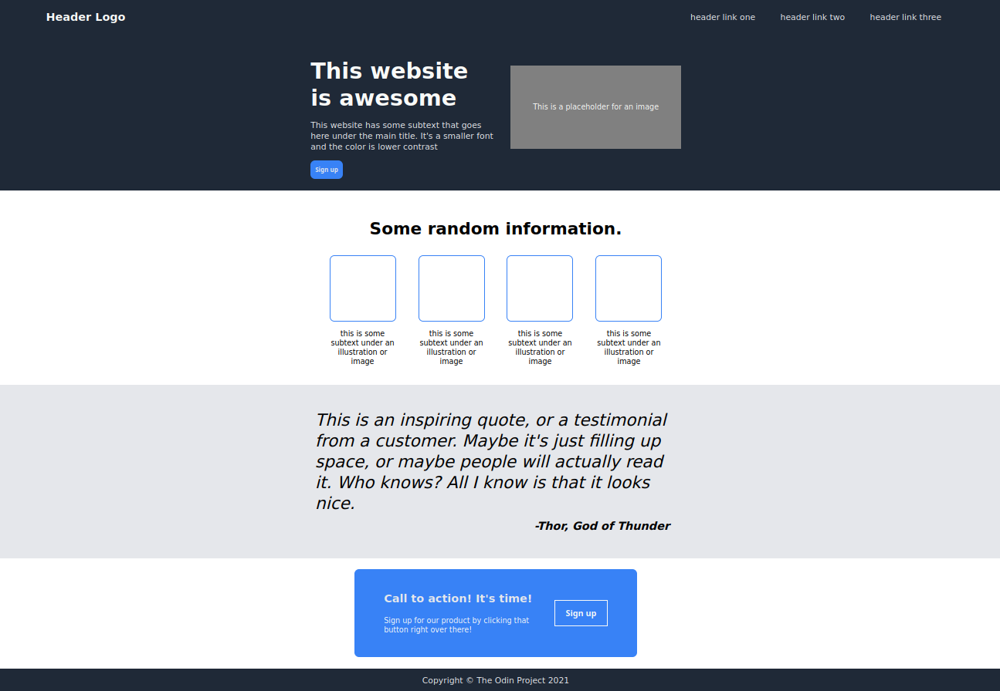
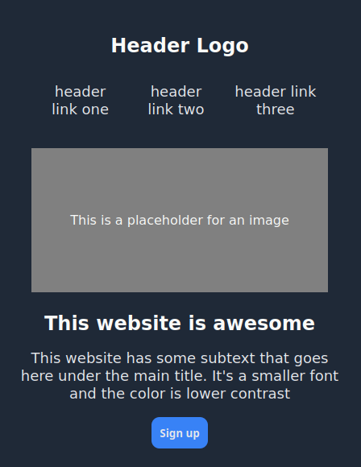
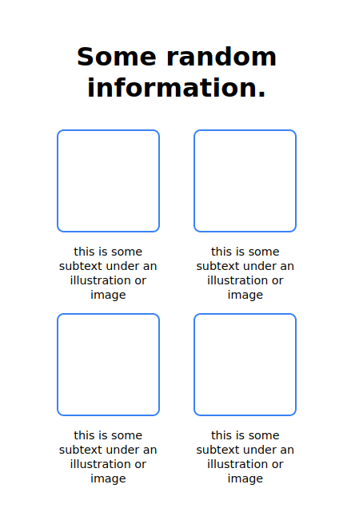
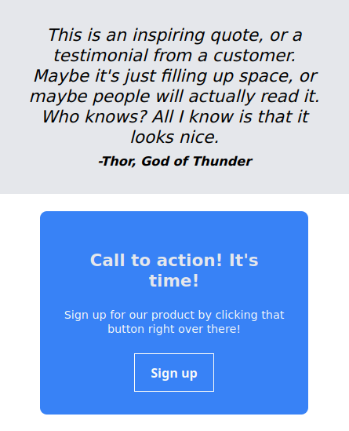

# Landing Page

The goal of this project was to clone a CSS design given a folder of a few assets.

### In this project

1. I was able to learn about <strong>custom properties (variables)</strong> using the <strong>root pseudo</strong> class. This allowed me to make fonts and colors consistent across the whole page. 
2. I learned about <strong>relative units</strong> such as ems and rems. I tried to replace all instances of px with either em or rem. I'm still not sure if I used the right one in the right spot, but <strong>no ems blew up with compounding issues</strong>!
3. I learned about <strong>media queries</strong> and applied them to my page to make it significantly more <strong>responsive</strong>. I attempted to make this page <strong>mobile first</strong> so that queries responded to the page growing larger.
4. I reorganized my CSS into sections. Global Styles, Typography, Layout, and Components. I feel as though this method of organization helped me as I was cleaning everything up and fixing issues.
5. I attempted to rename everything using the <strong>BEM naming convention</strong>. I like that this naming convention allows me to select specific classes instead of having to combine selectors in some complicated way. I personally felt as though this made it extremely easy to identify which code belonged to what attributes. I think I will keep this until I find something better!

### Screenshots

    <figure>
        <figcaption>Full Page</figcaption>
        
    </figure>
    <figure>
        <figcaption>Responsive Media Queries 1</figcaption>
        
    </figure>
    <figure>
        <!-- <figcaption>Responsive Media Queries 2</figcaption> -->
        
    </figure>
    <figure>
        <!-- <figcaption>Responsive Media Queries 3</figcaption> -->
        
    </figure>

